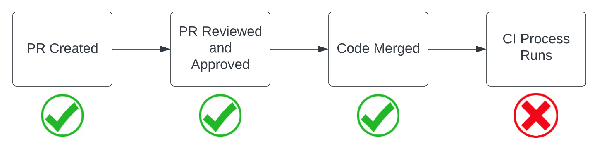
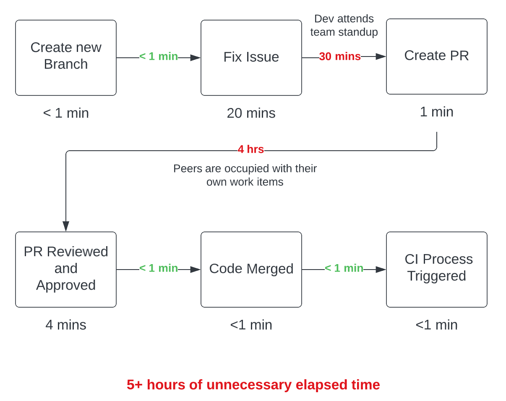

## What is the problem to be solved?

The Continuous Integration (CI) process is failing after following the approval of a pull request (PR) and the subsequent merge of code.

Not only does this block this specific change set from flowing through the CI/CD process, but it can also block all others as the breaking change was already merged into the branch that is used to trigger the CI process.

### Example

1. After a pull request is approved and the feature branch is merged, the CI process is triggered to build and test the code.
2. Either the build fails or the tests do.
3. Developer creates a new branch to fix the issue.
4. Developer fixes the issue.
5. Developer creates a pull request (PR) for the new branch with the fix.
6. The PR is reviewed and approved.
7. The PR is merged.
8. CI process triggered and runs successfuly (hopefully).

Steps 3-8 don't seem like a big deal on the surface. However, let's identify both the time it might take to perform those steps and the delay time between which certain steps may be performed.

## What is the fix?

Pull request build validation

### What does this mean?

Pull request build validation is the concept of running your build and test procedures (as they are defined in your CI process) automatically against the code that's included in a pull request at the time that it's opened.

### How does this solve the problem?

Developers can get immediate feedback that their recent work is causing the CI process to fail and can address it immediately in a new commit prior to any further actions being taken on the PR they've opened.

*Eliminating disruptions that introduce **toil** and unnecessary **cognitive load** are critical to building happy and healthy dev teams.*

### How do you implement build validation?

Many code repositories offer policies which you can configure and enforce that will trigger build validation to occur on:

- Pull request creation
- As commits are pushed to the branch in the pull request
- Other events and time-bound scenarios
