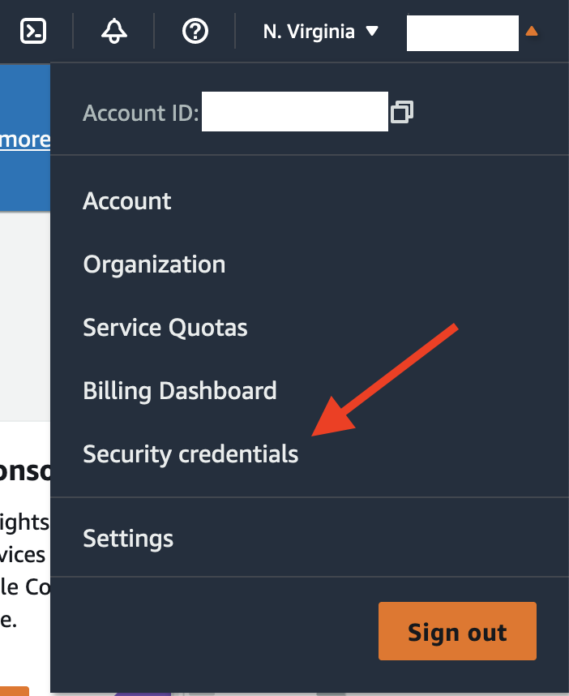
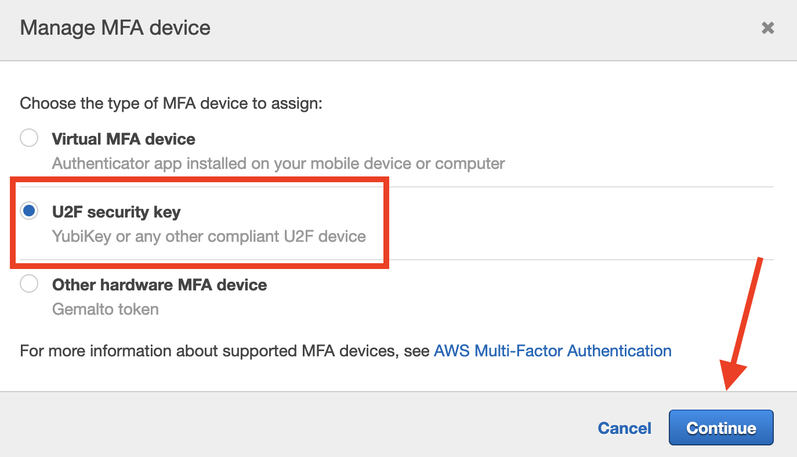
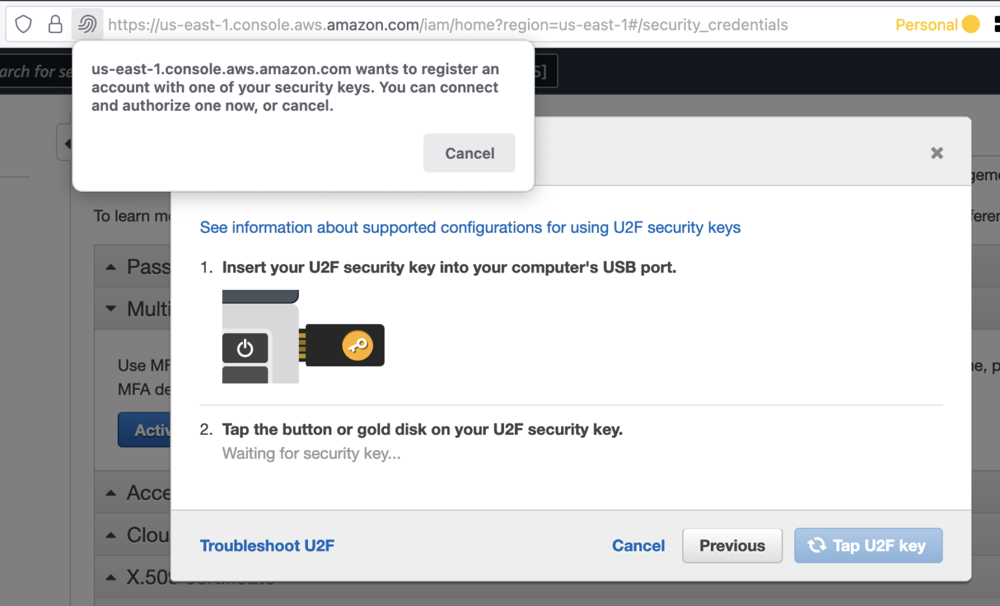
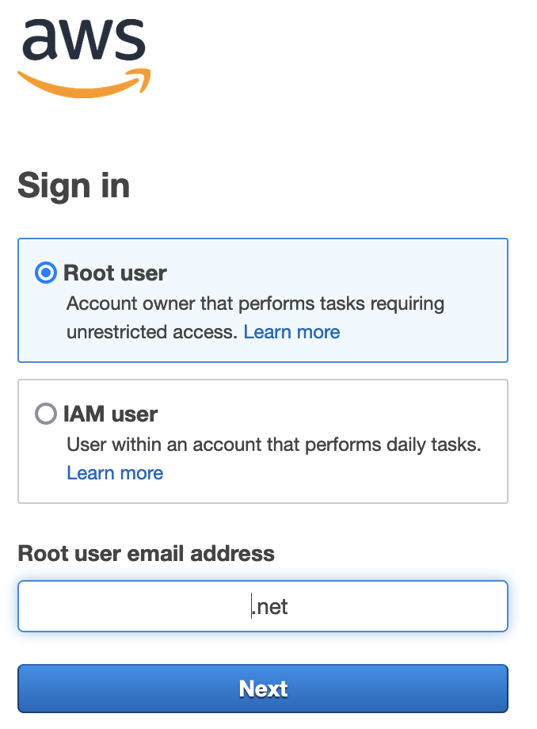
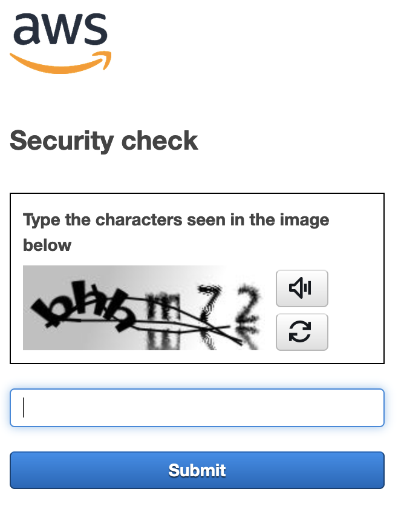
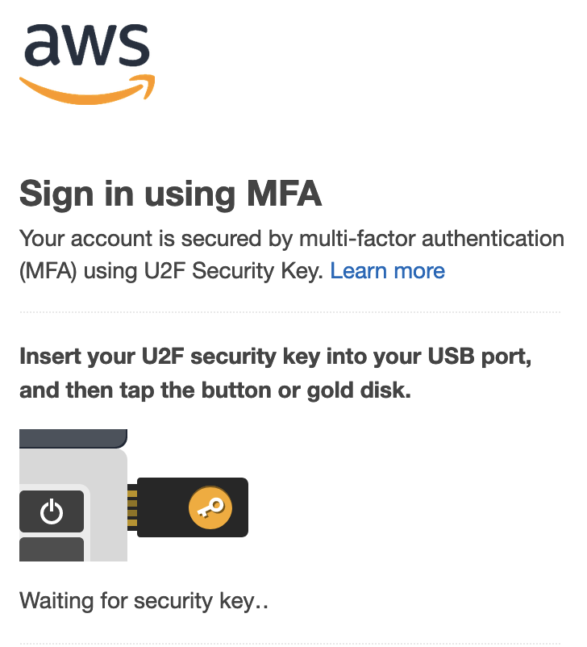

---
cover:
  image: images/cover.png
title: "Secure AWS Account Root User with U2F Keys"
date: 2022-11-17T22:06:15-05:00
draft: false
twitter:
  image: images/cover.png
---

The AWS Account Root User is the identity that has complete access to all AWS services and resources in an AWS account. The scenarios that require you to use the root user are pretty sparse, so it's good practice to secure the accounts with Multi-Factor Authentication (MFA), store the credentials in a password manager (also protected by MFA), and create named IAM users for any of your AWS account administrative needs.

Your options to secure the account root user with MFA are:

1. Virtual MFA Device (Microsoft Authenticator, Authy, Google Authenticator, etc.)
2. Universal 2nd Factor (U2F) Security Key (Yubikey)
3. Hardware MFA Device (Gemalto Token)

My go-to is to use option 2 - U2F Keys. They are relatively cheap, easy to acquire, and user-friendly. I'm specifically a fan of the Yubikey brand of U2F keys manufactured by Yubico.

What exactly are they and how do they work? Check out this quick video...



## Why not Virtual MFA?

Wait...why don't I just use the Virtual MFA Device option? It's free and it doesn't require me to keep track of a physical object! That's true, but in addition to U2F keys preventing you from having to deal with account management hell (as employees leave, people change devices, etc.) hardware-based security also offers the benefit that it is much more difficult to successfully attack remotely.

## Activate U2F Key MFA for an Account Root User

When logged in as the account root user:

1. On the right side of the navigation bar, choose your account name, and choose **Security Credentials**

1. Navigate to the Multi-factor authentication section and click Activate MFA

1. Click on the U2F security key radio button and click Continue

1. If not already, insert your U2F key into your computer and tap the button.

1. You’ve successfully secured the root user account with your U2F Key.

## Logging into your account root user using your U2F key

When the scenario does come up for you to test your login as the root user or to perform one of those specific activities that requires the root user, it’s super simple!

1. Supply the root user email address

2. Complete the security check, click submit

3. Enter the password for the root user, click sign in

4. When prompted for the U2F key, tap the button

5. You will then be redirected to the console homepage of your AWS account

## Recommendations when using U2F keys for the Account Root Users

- A single key can be used for multiple AWS account. However, consider the blast radius if a single key were to be lost.
- 1 key should be used to secure the account root user on the Management (Master) account.
- 1 key should be used for all development accounts
- 1 key should be used for all staging/qa accounts
- 1 key should be used for all production accounts
- After MFA is activated on the root user accounts using U2F keys, the keys should be locked in an appropriate physical safe (i.e. one managed and protected by corporate security in an on-site facility).